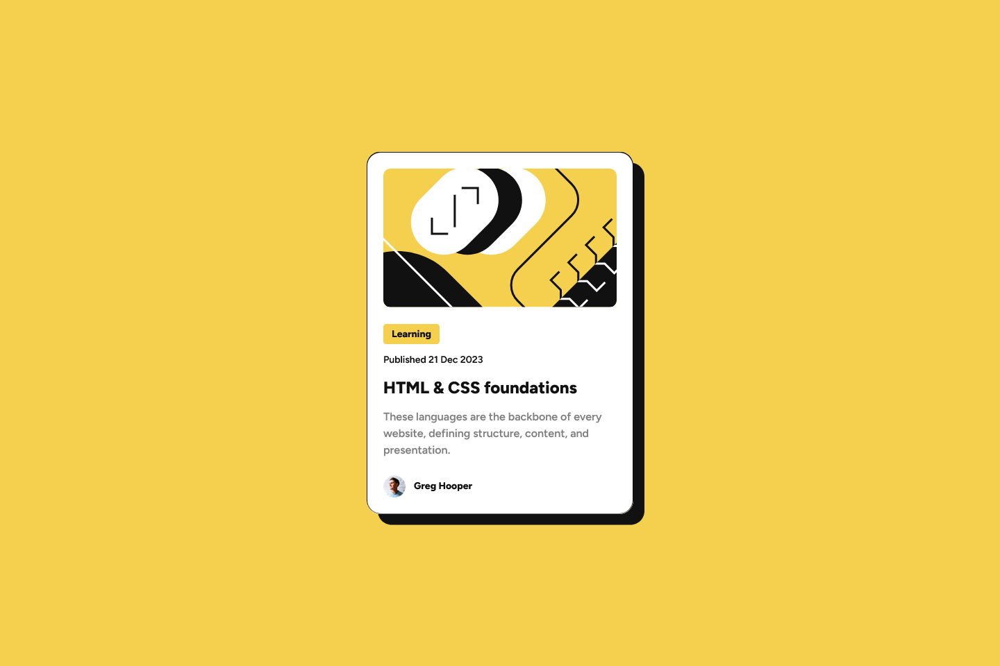

# Frontend Mentor - Blog preview card

This is a solution to the [Blog preview card challenge on Frontend Mentor](https://www.frontendmentor.io/challenges/blog-preview-card-ckPaj01IcS). Frontend Mentor challenges help you improve your coding skills by building realistic projects.

## Table of contents

- [Overview](#overview)

- [The challenge](#the-challenge)

- [Screenshot](#screenshot)

- [Links](#links)

- [My process](#my-process)

- [Built with](#built-with)

- [Author](#author)

## Overview

### The challenge

Users should be able to:

- Your challenge is to build out this blog preview card and get it looking as close to the design as possible.

- Your users should be able to: See hover and focus states for all interactive elements on the page

### Screenshot

### Links

- [Solution](https://github.com/beqarion/blog-preview-card)

- [Live Site](https://beqarion.github.io/blog-preview-card/)

## My process

### Built with

- Semantic HTML5 markup

- Vanilla JS

- CSS custom properties

- Flexbox

- CSS Grid

- Mobile-first workflow

## Author

- Frontend Mentor - [@beqarion](https://www.frontendmentor.io/profile/beqarion)
